# Pintos project 1

我英语水平一般，将就着看看吧

## Preliminaries

**Pintos** is a simple instructional operating system framework for x86 instruction set architecture. It supports kernel threads, loading and running user programs and a file system, but it implements all of these in a very simple way.

In this project, the objective is to accomplish the **thread** part of Pintos.

This major part (task 1 ~ 3) of the project is finished on 7th March. Thanks to the winter vacation, I finished it early though my progress was not so fast.

## Result of Task 1 to 3

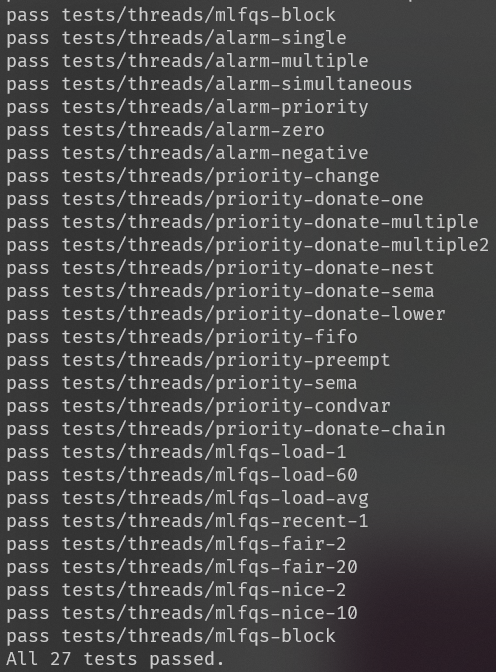

## Coding Standards

- All the added and modified codes are written in the GNU style and largely follows the GNU Coding Standards.
- Limit all C source file lines to at most 79 characters long.
- All previous codes which are removed have been deleted from the files.
- All new functions and variables are well commented

## My Design

### Task 1: Efficient Alarm Clock

#### Data structures and functions

In `thread.h`:
Add two new attributes to represent the remaining ticks before waking up the thread.

1. `sleepelem` is the list element for sleeping threads.
2. `remaining_time_to_wake_up` is ticks remaining from waking up, with an initial value 0.

```c
struct thread
  {
    ...
    struct list_elem sleepelem;
    int64_t remaining_time_to_wake_up;
  }
```

#### Algorithms

The main shortcomings of the formal codes is that, all threads ( including the sleeping threads and normal threads ) share the same storage space.

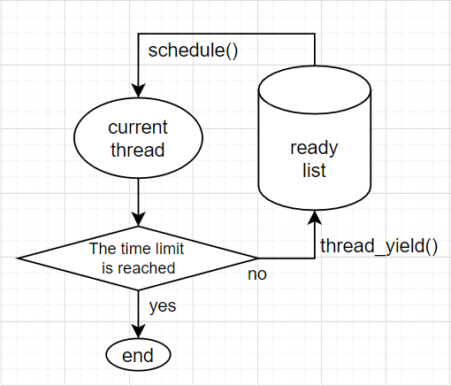

So, instead of the `ready_list`, I arrange another array to store the sleeping threads: `sleeping_threads`.

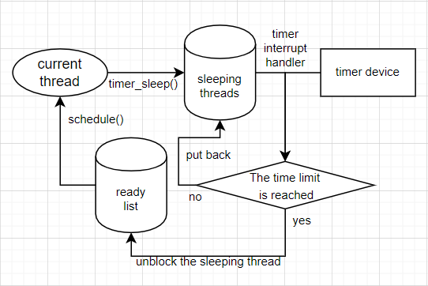

Firstly, call the function `thread_block()` to block the current thread ( also the thread goint to sleep ). In this step, another thread in the top of ready list will replace the "current thread".

Set the `remaining_time_to_wake_up` of the sleeping threads to the given sleep time (unit: tick). Find the sleeping thread into the `sleeping_list`.

For every tick, the timer device will send an interrupt, and call the interrupt handler function `timer_interrupt()`. In this function, reduce the `remaining_time_to_wake_up` of all sleeping threads in `sleeping_list` by 1.

If any of the sleeping threads has a zero `remaining_time_to_wake_up`, then it can be considered that these threads have been "waken up".

Unblock them, then these threads will be put into the ready list.

#### Synchronization

1. **How are race conditions avoided when multiple threads call timer_sleep() simultaneously?**

   Actually, as long as the `time_sleep()` is not called in the interrupt context, multiple threads cannot really call this function simultaneously. Then, all operations done to the `sleeping_list` is thread-safe.

2. **How are race conditions avoided when a timer interrupt occurs during a call to timer_sleep()?**

   With the interrupt disabled during the thread operation, this function is almost "atomic".

   ```c
   enum intr_level old_level = intr_disable ();
   ...
   intr_set_level (old_level);
   ```

#### Rationale

I have thought about just making `all_list`  to replace `sleeping_list`, because all alive threads are naturally in `all_list`, then if this design is taken, there will be no needs to insert put sleeping threads in another place.

However, this function `thread_foreach()`, which is used for traversing all threads, is not always safe.

```c
/* Invoke function 'func' on all threads, passing along 'aux'. This function must be called with interrupts off. */
void
thread_foreach (thread_action_func *func, void *aux);
```

Besides, in practical use, there will be a great amount of threads in `all_list`. The traversing may wastes a lot of time if there are too many threads which are not sleeping.

### Task 2: Priority Scheduling

#### Data structures and functions

1. In `thread.h`:

   Add three attributes in the struct `thread`:

   `real_priority` is used to store the real priority when the attribute `priority` is occupied,

   `locks_held` is used for priority donation,

   `current_lock` is used for recursive donation.

   ```c
   struct thread
     {
       ...
       int real_priority;
   	struct list locks_held;
   	struct lock *current_lock;
     };
   ```

2. In `synch.h`:

   Add two attributes in the struct `lock`:

   `elem` functions as a linked list node,

   `max_priority` is the max priority in the `waiters` list of the `semaphore` (its value is legal because the waiting threads will never change their priority or real_priority).

   ```c
   struct lock 
     {
       ...
   	struct list_elem elem;
   	int max_priority;
     };
   ```

3. In `synch.c`:

   Add one attribute to the struct `semaphore_elem`:

   `priority` means the maximum priority within the waiting threads in WAITERS of the semaphore.

   ```c
   struct semaphore_elem 
     {
       ...
   	int priority;
     };
   ```

   

4. Let's explain the data structure used to track priority donation with a sequence of diagrams of a nested donation: (Simulate the test `priority-donate-nest`)

   1. The original thread initializes two locks,

      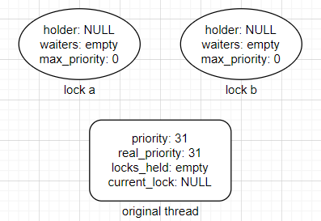

   2. The original thread acquire lock `a`,

      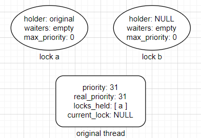

   3. Create a thread `medium` with priority 32. After `thread_yield()`, as `medium` has a higher priority than the original thread, the CPU is yielded. Then it acquires lock `b`, and tries to acquire lock `a`, but `a` is held by the original thread, then donate priority to the original thread,

      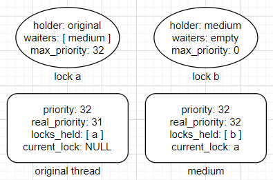

   4. Return to original thread, create thread `high` with priority 33. After `thread_yield()`, as `high` has a higher priority than the original thread, the CPU is yielded. `high` tries to acquire lock `b` but failed, then it gets blocked. Recursively donate `medium` and the original thread,

      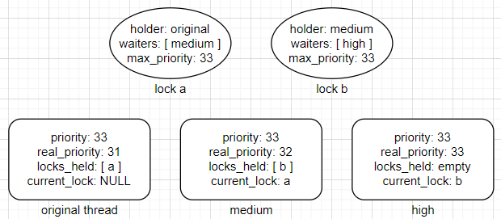

   5. Return to the original thread, release `a`, then `medium` is put back to `ready_list`. The priority of the original thread return to the real priority. After `thread_yield()`, `medium` will be the next thread to run,

      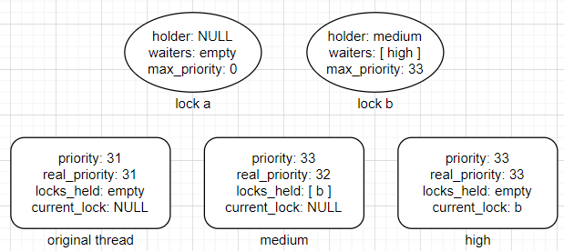

   6. Return to `medium`, `medium` holds `a`,

      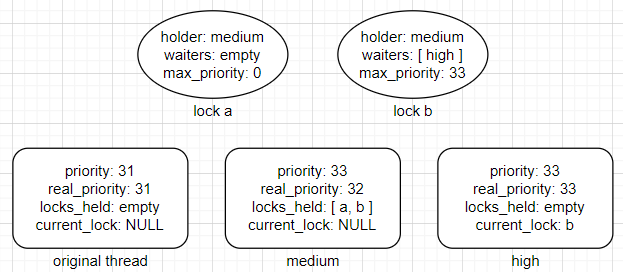

   7. `medium` releases `a`, after `thread_yield()`, the next thread to run is still `medium`. Then release `b`. The priority of `medium` will return to the real priority. After `thread_yield()`, the next thread to run is `high`,

      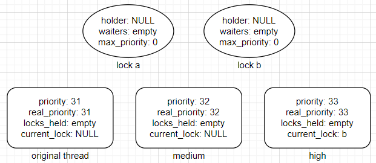

   8. Return to `high`, `high` holds `b`,

      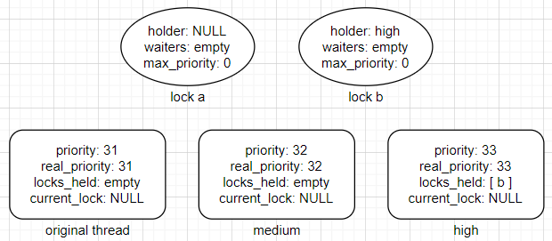

   9. `high` release `b`, then `high` finished. The next thread to run is `medium`, then `medium` finished. The next thread to run is the original thread, then the original thread finished.

#### Algorithms

##### Choosing the next thread to run

The function `schedule()`will call `next_thread_to_run()` to get the next thread from `ready_list`. 

The `ready_list` is always sorted in ascending order. according to the priority of threads it containing. When setting a thread as `THREAD_READY`, put it to `ready_list` by function `list_insert_ordered()`; find the next thread to run at the end of `ready_list`.

##### Acquiring a Lock

When a call to `lock_acquire()`, the first thing to do is the priority donation. Before `sema_down()`, we can judge whether a lock is held or not by checking if the `holder` is null.

If the priority of the holder is smaller than that of the current thread, then update the "donated" priority of the lock and the holder.

If the holder is also locked by other locks, then repeat the above procedures, recursively.

After `sema_down()`, the current thread will hold the lock. Put the lock into the `locks_held` of the thread. Update priority of the lock and the current thread.

If next thread to run in the `ready_list` has a higher priority than the current thread, yield the CPU.

##### Releasing a Lock

Set the holder of the lock as NULL, remove the lock from the `locks_held` of the current thread. 

Update the priority of the current thread. If this lock is the last lock the current thread holds, then restore the real priority of the current thread.

Then `sema_up()`.

##### Computing the effective priority

When acquiring a lock, the real priority will not be stored in `priority`, because the "donated" priority is different from the real priority.

At any time when releasing a lock, `priority` will be assigned `real_priority`.

##### Priority scheduling for semaphores and locks

To ensure that the highest priority thread waiting for a lock or semaphore variable wakes up first, the function `list_max` is always used when acquiring next thread to be unblocked from the `waiters` in the semaphore (lock is based on semaphore). Use the sort function `compare_threads_by_priority()`.

##### Priority scheduling for condition variables

Similarly to **Priority scheduling for semaphores and locks**,  make the `waiters` in condition sorted.

##### Changing thread’s priority

For the developers of PINTOS, the only available way to change threads' priority is `thread_set_priority()`. This function can only change the priority of the current running thread.

The new priority should be firstly assigned to `real_priority`.

If the list `locks_held` is empty, it means that there is no priority donation on the current thread. Then the `priority` will be assigned new priority. If the list is not empty but the new priority is greater than the previous priority of the thread, the `priority` will be also assigned new priority.

After possible changes to the `priority` and `real_priority`, in case `priority` is smaller than the thread with maximum priority in the `ready_list`, call the function `thread_yield()`, to ensure that the current thread always has the highest possible priority.

#### Synchronization

The most possible potential race is in `thread_set_priority()`. As stated above, if the priority of the current thread is smaller than that of any threads in the `ready_list`, there should be CPU yielding.

However, because the operation of changing priority and yielding the CPU is under the condition of disabling the interrupt, these operations could be considered as atomic. Then there won't be such problem.

#### Rationale

One potential problem I concerned about is that, too many interface functions are exposed to outside, which can result in users being given permissions that they should not have.

This may lead to security issues, but I have no idea how to solve it.

### Task 3: Multi-level Feedback Queue Scheduler

#### Data structures and functions

1. In `thread.h`:

   Add two attributes to the struct `thread`:

   `nice` determines how “nice” the thread should be to other threads,

   `recent_cpu` measures the amount of CPU time a thread has received "recently."

   ```c
   struct thread
     {
       ...
       int nice;
       fixed_t recent_cpu;
     };
   ```

2. In `thread.c`:

   Add a global variable `load_avg`, which estimates the average number of threads ready to run over the past minute.

   ```c
   static fixed_t load_avg;
   ```

#### Algorithms

##### Advanced Scheduler

Different from TASK 2, there is no priority donation in the MLFQ scheduler, as the priority of threads are not set by users, but calculated by the OS itself.

Firstly we have to maintain a variable: the system load average, denoted as `load_avg`, and it's actually a weighted moving average of the amount of waiting threads in `ready_list` and the current thread (except for the `idle_thread`). At system boot, it's initialized to 0. Per second thereafter, it is updated according to the following formula:
$$
load\_avg = \frac{59}{60} \times load\_avg + \frac{1}{60} \times (\#\ of\ ready\ threads)
$$
In every thread, there will be two attributes named `recent_cpu` and `nice`. The meanings of these two variables have been explained in **Data Structures and Functions**.

`recent_cpu` is a exponentially weighted moving average of `nice`. Each time a timer interrupt occurs, recent_cpu is incremented by 1 for
the running thread only. In addition, once per second recalculated `recent_cpu` of all threads according to the following formula:
$$
recent\_cpu = \frac{2 \times load\_avg}{2 \times load\_avg + 1} \times recent\_cpu + nice
$$
 `nice` is not dynamic, but set by users, with a default value 0. The value of `nice` is between -20 to 20.

The `priority` of a thread is calculated as follows:
$$
priority = PRI\_MAX - \frac{recent\_cpu}{4} - (2 \times nice)
$$
For every four ticks, recalculate the `priority` of the current thread. And then, call `thread_yield()` if there are waiting threads which have higher priority than the current thread.

#### Synchronization

The usage and the assignment of the global variable `load_avg` may conflict with each other, and it's the same for the other struct-specific variables. 

To avoid these problems, always disable the interrupt when changing and using these variables.

```c
enum intr_level old_level = intr_disable ();
...
intr_set_level (old_level);
```

#### Rationale

1. My design is actually a quite natuaral and simple designing. Only the needed calculations are taken, which could be considered as an advantage.
2. The fixed point number calculations are defined as macros in `fixed_point.h`. In the test, there are always some strange differences between the result and the expectation output. But when I turned the 15.16 FP into the 16.15 FP, the outputs of my codes meet the requirements. This may be due to a difference in accuracy.

## Additional Questions

### 1. 

> Suppose threads A, B, and C have nice values 0, 1, and 2. Each has a recent_cpu value of 0. Fill in the table below showing the scheduling decision and the recent_cpu and priority values for each thread after each given number of timer ticks. We can use R(A) and P(A) to denote the recent_cpu and priority values of thread A, for brevity.

Suppose threads A, B, and C have nice values 0, 1, and 2. Each has a recent_cpu value of 0. The table below shows the scheduling decision and the priority and recent_cpu values for each thread after each given number of timer ticks. To simplify the problem, assume that `TIMER_FREQ` is greater than 36.

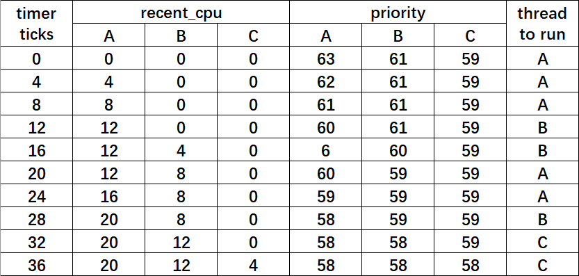

### 2.

> Did any ambiguities in the scheduler specification make values in the table (in the previous question) uncertain? If so, what rule did you use to resolve them?

Yes. 

Actually, in my codes (and also in the tests), the thread yielding does not occur after the priority has been changed, and the yielding is prohibited in the interrupt context.

So I didn't change the running thread to another with a higher priority, unless it calls `thread_yield()`. 

## Reference

1. http://web.stanford.edu/class/cs140/projects/pintos/pintos.html
2. *Operating System Concepts (9th Ed)*
3. https://www.cnblogs.com/laiy/p/pintos_project1_thread.html
4. https://zhuanlan.zhihu.com/p/104497182
5. https://blog.csdn.net/ljianhui/article/details/10243617